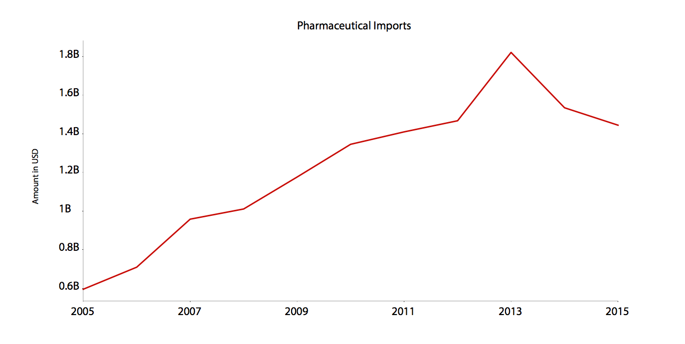
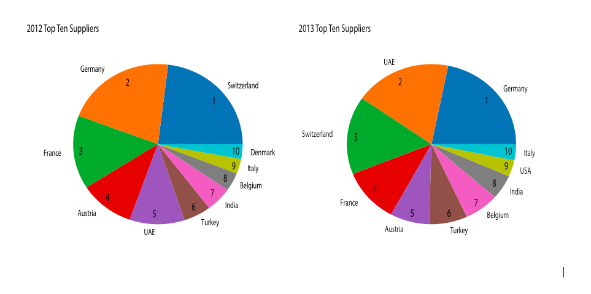
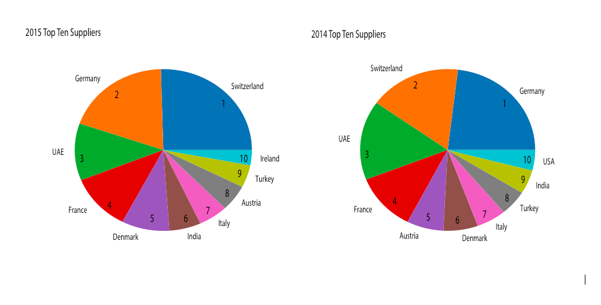
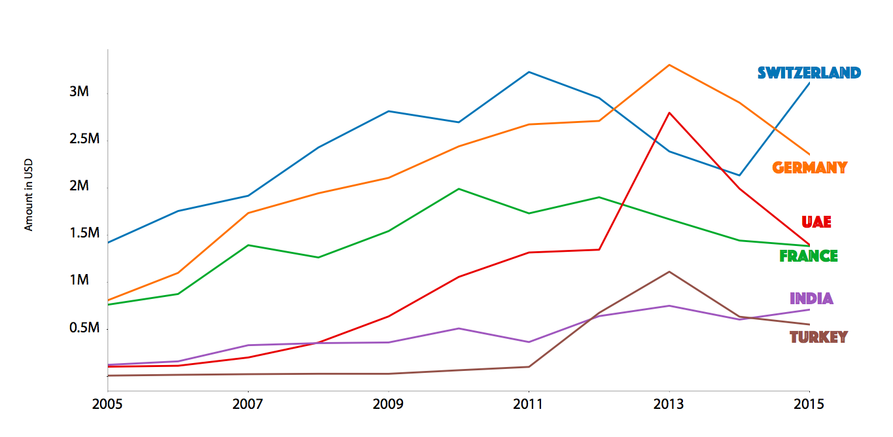
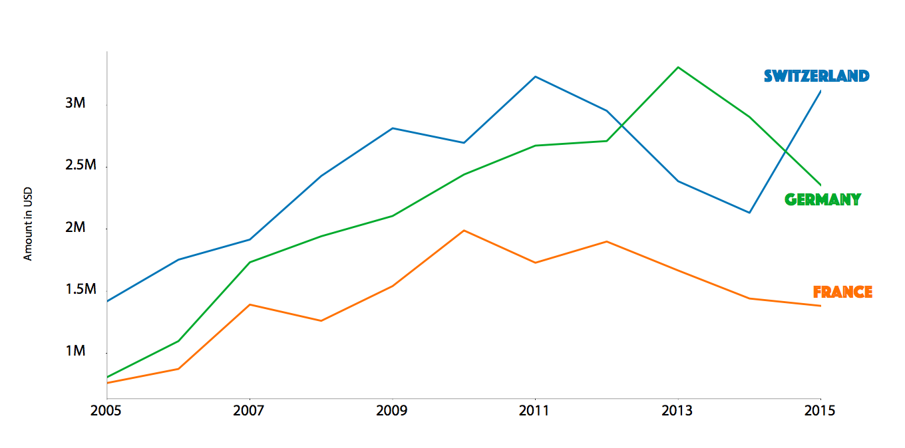
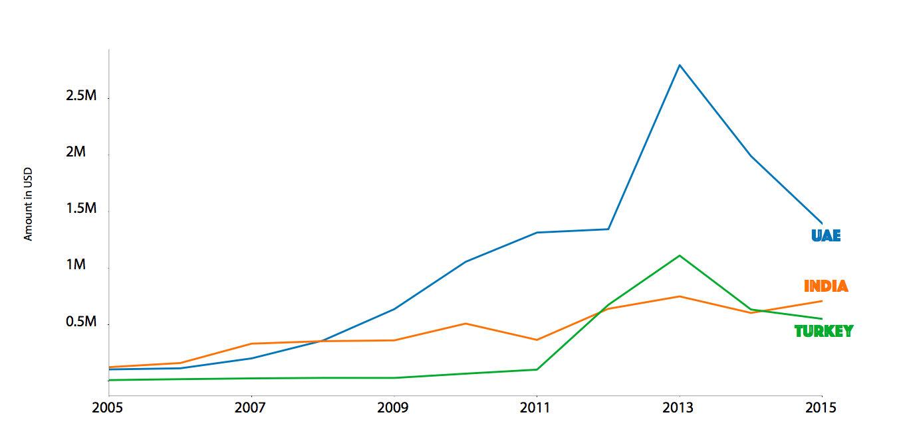
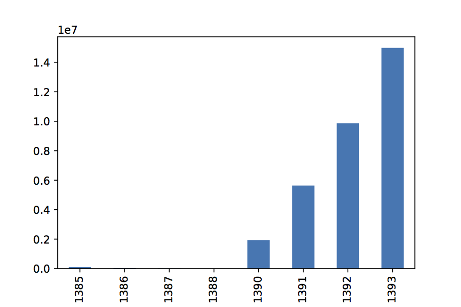
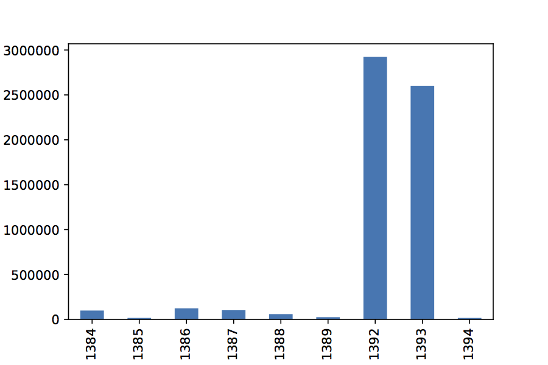

---

title: A Very Cool Project
layout: project

---

# The impact of sanctions on Iranian market

In June 2010, in response to Iran's nuclear program, the UN's Security Council imposed economic sanctions on Iran. These set of sanctions were followed by EU sanctions in October 2010, and a round of US sanctions (September 2010, May 2011 and November 2011). As a result Iran faced many banking hurdles/restrictions. The sanctions showed it's effect in late 2012 and Iran's imports, including the import of pharmaceuticals dropped.

‌‌Between 2012-2013 there were reports on the lack of medicine in Iran. In November 2012 Iran media reported on a death of a Haemophiliac Iranian boy due to the shortage of medicine in Iran.

Prior to sanctions, Iran's main pharmaceutical suppliers were the European countries and the USA. But after the sanctions were imposed, things gradually began to change.

As the imports from Switzerland, Germany, and France (Iran's three main suppliers) started to drop, imports from UAE, Turkey and India began to rise.

On the other hand, new suppliers lined up to take over, including Oman, Georgia, Egypt, Qatar, Bulgaria, Czechia, Russia and Tajikistan. [I HAVE BAR CHARTS FOR EACH, BUT WASN'T ABLE TO PUT THEM ON TOP OF EACH OTHER]

Qatar Example:

Egypt Example:

In 2013 Iranian ministry of health warned about the bad quality of medicine, especially anesthetics, in the market adding that every week a number of patients die from low-quality anesthetics.

At that's not all. Besides the International hurdles, Iran also didn't help solve the issue, but added to the problem. From March 2012 to July 2013, Iran’s Central Bank made available an undisclosed amount of US dollars at a highly subsidised rate of 12,260 rials to pay for the imports of vital goods, especially food and medicine, but as the ministry of health scrambled for supplies, Custom documents show that Iran spent subsidised dollars on luxury goods, including cars.

In the end the economic uncertainty in Iran not only changed Iran's import trend, but also had irrecoverable consequences on Iranian patients.

THIS IS A TERRIBLE ENDING, BUT I AM TOO TIRED TO THINK PROPERLY.